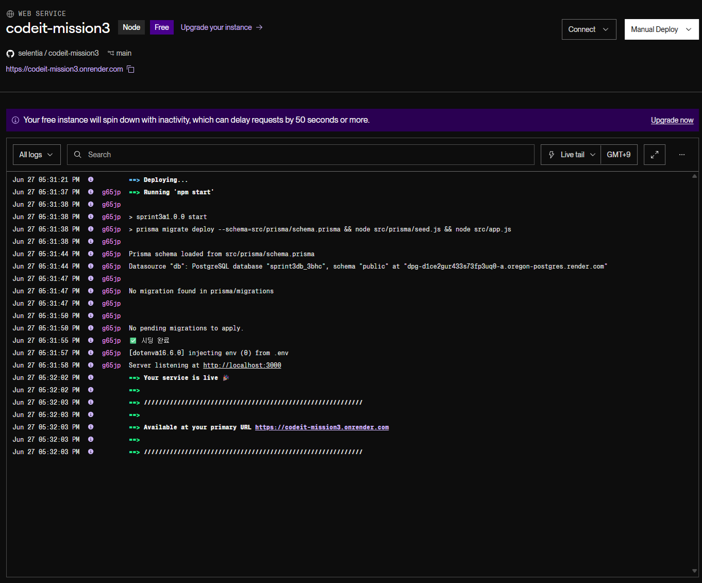

## 요구사항

### 기본

- [x] PostgreSQL를 이용해 주세요.
- [x] 데이터 모델 간의 관계를 고려하여 onDelete를 설정해 주세요.
- [x] 데이터베이스 시딩 코드를 작성해 주세요.
- [x] 각 API에 적절한 에러 처리를 해 주세요.
- [x] 각 API 응답에 적절한 상태 코드를 리턴하도록 해 주세요.

### 중고마켓

- [x] Product 스키마를 작성해 주세요.
  - id, name, description, price, tags, createdAt, updatedAt 필드를 가집니다.
  - 필요한 필드가 있다면 자유롭게 추가해 주세요.
- [x] 상품 등록 API를 만들어 주세요.
  - name, description, price, tags를 입력하여 상품을 등록합니다.
- [x] 상품 상세 조회 API를 만들어 주세요.
  - id, name, description, price, tags, createdAt를 조회합니다.
- [x] 상품 수정 API를 만들어 주세요.
  - PATCH 메서드를 사용해 주세요.
- [x] 상품 삭제 API를 만들어 주세요.
- [x] 상품 목록 조회 API를 만들어 주세요.
  - id, name, price, createdAt를 조회합니다.
  - offset 방식의 페이지네이션 기능을 포함해 주세요.
  - 최신순(recent)으로 정렬할 수 있습니다.
  - name, description에 포함된 단어로 검색할 수 있습니다.
- [x] 각 API에 적절한 에러 처리를 해 주세요.
- [x] 각 API 응답에 적절한 상태 코드를 리턴하도록 해 주세요.

### 자유게시판

- [x] Article 스키마를 작성해 주세요.
  - id, title, content, createdAt, updatedAt 필드를 가집니다.
- [x] 게시글 등록 API를 만들어 주세요.
  - title, content를 입력해 게시글을 등록합니다.
- [x] 게시글 상세 조회 API를 만들어 주세요.
  - id, title, content, createdAt를 조회합니다.
- [x] 게시글 수정 API를 만들어 주세요.
- [x] 게시글 삭제 API를 만들어 주세요.
- [x] 게시글 목록 조회 API를 만들어 주세요.
  - id, title, content, createdAt를 조회합니다.
  - offset 방식의 페이지네이션 기능을 포함해 주세요.
  - 최신순(recent)으로 정렬할 수 있습니다.
  - title, content에 포함된 단어로 검색할 수 있습니다.

### 댓글

- [x] 댓글 등록 API를 만들어 주세요.
  - content를 입력하여 댓글을 등록합니다.
  - 중고마켓, 자유게시판 댓글 등록 API를 따로 만들어 주세요.
- [x] 댓글 수정 API를 만들어 주세요.
  - PATCH 메서드를 사용해 주세요.
- [x] 댓글 삭제 API를 만들어 주세요.
- [x] 댓글 목록 조회 API를 만들어 주세요.
  - id, content, createdAt 를 조회합니다.
  - cursor 방식의 페이지네이션 기능을 포함해 주세요.
  - 중고마켓, 자유게시판 댓글 목록 조회 API를 따로 만들어 주세요.

### 유효성 검증

- [x] 상품 등록 시 필요한 필드(이름, 설명, 가격 등)의 유효성을 검증하는 미들웨어를 구현합니다.
- [x] 게시물 등록 시 필요한 필드(제목, 내용 등)의 유효성 검증하는 미들웨어를 구현합니다.

### 이미지 업로드

- [x] multer 미들웨어를 사용하여 이미지 업로드 API를 구현해주세요.
- [x] 업로드된 이미지는 서버에 저장하고, 해당 이미지의 경로를 response 객체에 포함해 반환합니다.

### 에러 처리

- [x] 모든 예외 상황을 처리할 수 있는 에러 핸들러 미들웨어를 구현합니다.
- [x] 서버 오류(500), 사용자 입력 오류(400 시리즈), 리소스 찾을 수 없음(404) 등 상황에 맞는 상태값을 반환합니다.

### 라우트 중복 제거

- [x] 중복되는 라우트 경로(예: /users에 대한 get 및 post 요청)를 app.route()로 통합해 중복을 제거합니다.
- [x] express.Router()를 활용하여 중고마켓/자유게시판 관련 라우트를 별도의 모듈로 구분합니다.

### 배포

- [x] .env 파일에 환경 변수를 설정해 주세요.
- [x] CORS를 설정해 주세요.
- [x] render.com으로 배포해 주세요.
  
## 스크린샷
- Render 배포 로그 에서 `Your service is live 🎉` 문구 출력되어, 정상 배포 확인 완료.
- 배포 주소: https://codeit-mission3.onrender.com/

---

## 멘토에게
- 유효성 검증 관련 미들웨어는 `middlewares/`로 분리하고, 각 도메인 라우트에 맞게 적용하였습니다.  
  해당 미들웨어를 서비스 레이어에서 직접 적용하는 방식과 비교했을 때 현재 방식에 대한 멘토님 의견이 궁금합니다.
- 댓글 API는 등록/조회는 각 도메인(product, article) 라우터에 포함하고,  
  수정/삭제는 공통 commentRoutes로 나누었습니다.  
  comment보다는 product나 article이 주가 된다고 생각해서 이런 구조로 작성했습니다.  
  예를 들어 `/products/:productId/comments`나 `/articles/:articleId/comments`처럼 구성했습니다.  
  구조에 관한 멘토님 의견이 궁금합니다.