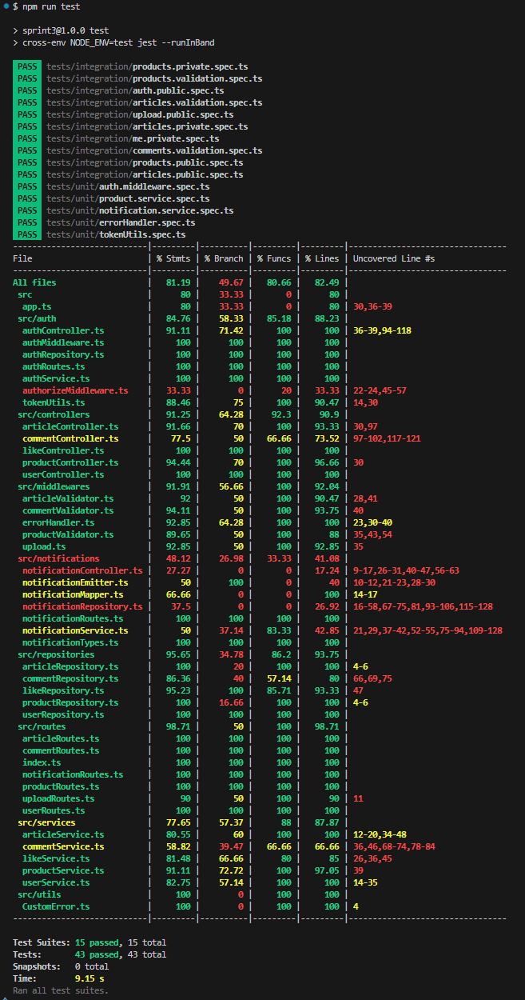

## 미션 목표
- Jest와 Supertest를 사용해 유닛 테스트, 통합 테스트 작성하기

## 요구사항

### 기본 요구사항
- [x] Jest의 테스트 커버리지 도구를 사용하도록 설정해 주세요.
- [x] 인증이 필요하지 않은 상품 API에 대한 통합 테스트를 작성해 주세요.  
- [x] 인증이 필요하지 않은 게시글 API에 대한 통합 테스트를 작성해 주세요.
- [x] 로그인, 회원가입 API에 대한 통합 테스트를 작성해 주세요.
- [x] 인증이 필요한 상품 API에 대해 통합 테스트를 작성해 주세요.
- [x] 인증이 필요한 게시글 API에 대해 통합 테스트를 작성해 주세요.

### 심화 요구사항
- [x] 상품 API의 비즈니스 로직에 대해 Mock, Spy를 활용해 유닛 테스트를 작성해 주세요. 

---

## 멘토에게
- 기본 및 심화 요구사항은 전부 구현하였으며, 이외의 임의 구현 내용을 이하 기재합니다.
- 요구사항 외의 영역에 대해 추가 테스트를 진행하였습니다. 영역과 테스트 내용은 아래와 같습니다.
  - 토큰 및 인증
    - `authMiddleware`
      - 토큰 누락 401
      - 위조/만료 토큰 403
      - 유효하지 않은 사용자 ID 토큰 403
    - `tokenUtils`
      - `verifyAccessToken` 만료/위조 403
      - `verifyRefreshToken` 잘못된 토큰 403
  - 검증 실패(Validator)
    - 게시글 생성/수정 시 title·content 미입력 400
    - 상품 생성 시 잘못된 price, 잘못된 imageUrl 400
    - 댓글 생성 시 content 누락 400
    - 잘못된 articleId 400
  - 업로드 API:
    - 이미지 업로드 성공 201
  - 사용자 정보(Me):
    - 내 정보 조회 200
    - 닉네임 변경 200
    - 비밀번호 변경 200
    - 내 상품 조회 200
    - 좋아요한 상품/게시글 조회 200
  - 알림 서비스(Notification)
    - `notificationService`
      - 잘못된 userId/postId/commentId 시 CustomError 발생
      - 알림 생성 시 유효하지 않은 파라미터 거부
  - 에러 핸들러
      - Multer 파일 크기 초과 400
      - 허용되지 않은 파일 400
- 테스트 커버리지 결과:  
  - Statements 81.19% / Branch 49.67% / Functions 80.66% / Lines 82.49%
  
## 테스트 실행 방법
- 모든 테스트 실행: npm run test
- 테스트 파일 변경 감지 후 자동 실행: npm run test:watch
- 테스트 커버리지 리포트 확인: npm run test:cov

## 테스트 결과

-아래는 실제 테스트 커버리지 결과입니다.  
