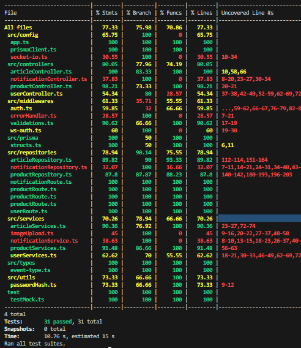

# 스프린트 미션 1

## Product, ElectornicProduct, Article 클래스

각 클래스는 아래와 같은 프로퍼티와 메소드를 가집니다

- Product
  1. name : string
  2. description : string
  3. price : number
  4. tag : array
  5. images : array
  6. favoritcount : number
  7. favorite() : method
     
- ElectornicProduct
  1. name : string
  2. description : string
  3. price : number
  4. tag : array
  5. images : array
  6. favoritcount : number
  7. favorite() : method
  8. manufacturer : string
 
- Article
  1. title : string
  2. content : string
  3. writer : string
  4. likeCount : number
  5. createdAt : Date 객체
  6. like() : method
 
  ## ProductService.js와 ArticleService.js

  panda market에서 제공하는 api를 활용한 메소드 모음입니다.

# 스프린트 미션 3

## 중고마켓, 자유게시판, 댓글 관련 API 작성 및 배포 미션

### 중고마켓 API
- 상품 등록
- 상품 상세조회
- 상품 수정
- 상품 삭제
- 상품 목록 조회

### 자유게시판 API
- 게시글 등록 
- 게시글 상세조회
- 게시글 수정
- 게시글 삭제
- 게시글 목록 조회

### 댓글 API : 중고마켓 댓글, 자유게시판 댓글 API가 구분되어 있습니다.
- 댓글 등록
- 댓글 수정
- 댓글 삭제
- 댓글 목록 조회

### 이미지 업로드 API
- jpg, jpeg, png, gif, webp 확장자 유효.
- 5MB까지 업로드 가능
- 단일 파일

### 유효성 검증
- 상품, 게시글, 댓글 : supersturct 모듈을 사용하여 입력값의 유효값을 검증하였습니다.
- 이미지 업로드 : multer 모듈의 filefilter와 limits속성을 사용하여 유효값을 검증하였습니다.

### 예외 처리
- 비동기 함수 처리 : express5 버전부터는 자동으로 잡아주기에 별도 함수를 작성하지 않았습니다
- 전역 예외 처리 : errorHandler라는 에러 핸들러 미들웨어를 구현하여 모든 미들웨어의 마지막에서 예외상황을 처리할 수 있도록 하였습니다. 400, 404, 500 등 알맞은 상태코드를 반환합니다.

### 라우트 중복 제거
- expressRoute() 함수를 사용하여 중고마켓과 자유게시판 관련 API들을 분리하였습니다.
- route() 함수를 통해 중복되는 경로를 제거하였습니다.

### DB
- 테이블 : 상품, 게시글, 상품 댓글, 게시글 댓글
- 관계 : 
    * 상품-상품 댓글 = 1:N
    * 게시글-게시글 댓글 = 1:N
- 관계를 맺고 있는 컬럼이 지워지면 관련된 컬림이 지워지도록 onDelete 옵션을 설정하였습니다
- 데이터베이스 시딩 코드를 작성하였습니다.

### 배포
- .env로 환경변수를 관리하였습니다 : DB, Port
- CORS를 설정하여 모든 도메인과 포트에서 연결할 수 있도록 설정하였습니다.
- render.com으로 배포하였습니다. 아래 url로 request를 보내 테스트 하실수 있습니다.
- https://three-sprint-mission-qlvt.onrender.com

### 멘토에게
- Route, Controller, Service로 분리해보았는데 잘 되었는지 궁금합니다.
- middlewares나 services에 들어가는게 알맞은 디렉토리로 구분되었는지 궁금합니다.

# 스프린트 미션 4

# 요구사항

## 유저 권한 인증 및 인가 구현 미션

### 인증
- User 스키마를 작성해 주세요.
    * id, email, nickname, image, password, createdAt, updatedAt 필드를 가집니다.
- 회원가입 API를 만들어 주세요.
    * email, nickname, password 를 입력하여 회원가입을 진행합니다.
    * password는 해싱해 저장합니다.
- 토큰 기반 인증: 로그인에 성공하면 Access Token을 발급

### 상품 기능 인가
- 로그인한 유저만 상품을 등록
- 상품을 등록한 유저만 해당 상품의 정보를 수정하거나 삭제

### 게시글 기능 인가
- 로그인한 유저만 게시글을 등록
- 게시글을 등록한 유저만 해당 게시글을 수정하거나 삭제

### 댓글 기능 인가
- 로그인한 유저만 상품에 댓글을 등록
- 로그인한 유저만 게시글에 댓글을 등록
- 댓글을 등록한 유저만 해당 댓글을 수정하거나 삭제

### 유저 정보
- 유저가 자신의 정보를 조회
- 유저가 자신의 정보를 수정
- 유저가 자신의 비밀번호를 변경
- 유저가 자신이 등록한 상품의 목록을 조회
- 유저의 비밀번호는 리스폰스로 노출하지 않습니다.

## 심화

### 인증
- 토큰 기반 인증: Refresh Token으로 토큰을 갱신
    * Refresh Token은 쿠키를 통해 전달

### 좋아요 기능
- 로그인한 유저는 상품에 '좋아요'와 '좋아요 취소'를 할 수 있습니다.
- 로그인한 유저는 게시글에 '좋아요'와 '좋아요 취소'를 할 수 있습니다.
- 상품 또는 게시글을 조회할 때, 유저가 '좋아요'를 누른 항목인지 확인할 수 있도록 isLiked와 같은 불린형 필드를 리스폰스 객체에 포함시켜 리스폰스해 주세요.
- 유저가 '좋아요'를 표시한 상품의 목록을 조회하는 기능을 구현합니다.

### 멘토에게
- 중복되는 부분이 있는 것 같으나 어떤 식으로 리팩토링을 하면 될 지 피드백을 받고 싶습니다.
- 심화 요구 사항을 구현하면서 토큰의 id값을 사용해야 하기에, 비회원일 경우 조회가 불가능하게 바뀌었습니다. 이 부분을 비회원도 조회하도록 하려면 어떤 식으로 로직을 작성하면 될지 피드백을 받고 싶습니다.
- 시딩 작업까지 수정해주어야 하기에 현재는 schema가 optional한 상태입니다, 다만 mock 데이터를 작성한다면 새로 추가해준 필드들도 필수 값으로 지정 가능할 것 같습니다.

# 스프린트 미션 5

## 자바스크립트 → 타입스크립트 마이그레이션

## 요구사항

### 기본

- [x] 스프린트 미션 4의 구현이 완료된 상태에서 진행을 권장합니다.
- [x] 타입스크립트 마이그레이션을 먼저 진행해 보고, 이전 미션에서 구현하지 못한 부분이 있다면 추가로 구현해 보세요.

### 프로젝트 세팅

- [x] `tsconfig.json` 파일을 생성하고, 필요한 옵션을 설정해 주세요. (예: `outDir`).
- [x] 필요한 npm script를 설정해 주세요. (예: 빌드 및 개발 서버 실행 명령어)

### 타입스크립트 마이그레이션

- [x] 기존 Express.js 프로젝트를 타입스크립트 프로젝트로 마이그레이션 해주세요.
- [x] 필요한 타입 패키지를 설치해 주세요.
- [x] `any` 타입의 사용은 최소화해주세요.
- [x] 복잡한 객체 구조나 배열 구조를 가진 변수에 인터페이스 또는 타입 별칭을 사용하세요.
- [x] 필요한 경우, 타입 별칭 또는 유틸리티 타입을 사용해 타입 복잡성을 줄여주세요.
- [x] 필요한 경우, `declare를` 사용하여 타입을 오버라이드하거나 확장합니다. (예: `req.user`)

### 개발 환경 설정

- [x] `ts-node` 를 사용해 `.ts` 코드를 바로 실행할 수 있는 npm script를 만들어 주세요. (예: `npm run dev`)
- [x] `nodemon`을 사용해 `.ts` 코드가 변경될 때마다 서버가 다시 실행되는 npm script를 만들어 주세요. (예: `npm run dev`)

## 심화 요구사항

### Layered Architecture 적용하기

- [x] Controller, Service, Repository로 나누어 코드를 리팩토링해 주세요.
- [x] 필요하다면, 계층 사이에서 데이터를 주고 받을 때 DTO를 활용해 주세요.

---
## 피드백 반영
- updatd 오타를 수정하였습니다.
- getArticleById를 호출하는 라우터에서도 인증 미들웨어를 추가하여 userId가 없을 수 있는 케이스를 처리하였습니다.
- 데이터 존재 검증하는 미들웨어 중복처리는 시간상 진행하지 못하였습니다.
- 비회원 조회 로직은 코드의 다른 부분들도 수정이 많이 필요할 것 같아 진행하지 못하였습니다.

## 멘토에게
- `supersturct`를 사용하기 위해 tsconfig의 `"target"`을 `"es2022"`와 같이 es모듈을 지원하도록 해야했습니다. 그러나 `ts-node`가 es 모듈을 해석할때 문제가 생겨 `ts-node`가 아닌 `tsx`를 사용하여 `npm run dev`를 작성하였습니다.
- `prisma.schema`의 위치가 변경되어 해당 위치를 알려주는 prisma.schema를 package.json에 추가하였습니다.
- Product와 Article을 Router, Controller, Service, Repository로 계층을 구분하여 프로젝트 전체 소스코드를 Layered Architecture에 맞게 리팩토링하였습니다.
- types 내부에 있는 파일명을 `.d.ts`가 아닌 `.ts`로 하면 불러올 수 없다는 에러가 있어 declare가 없는 파일도 우선 `.d.ts`로 구성하였습니다.

# 스프린트 미션 8

- 알림 기능 구현하기
- 웹소켓 또는 Socket.IO를 사용해 실시간 기능 구현하기

## 요구사항

### 기본
- 기존에 작업한 판다마켓 미션과 이어서 진행됩니다.
- 판다마켓 최종 디자인을 참고해주세요.

### 알림
- [x] 사용자는 자신의 알림 목록을 조회할 수 있습니다.  
- [x] 사용자는 자신의 안 읽은 알림의 개수를 조회할 수 있습니다.  
- [x] 사용자는 자신의 알림을 읽음 처리 할 수 있습니다.  
- [x] 클라이언트에서는 실시간으로 알림을 받을 수 있습니다.  

### 알림 전송
- [x] 좋아요한 상품의 가격이 변동되었을 때 알림을 보내주세요.  
- [x] 자신이 작성한 게시글에 댓글이 달렸을 때 알림을 보내주세요.  

---
## 멘토에게
- SocketIO 토큰 전달은 Postman의 테스트 환경을 위해 query파라미터로 전달받도록 설계하였습니다.

---
# 스프린트 미션 9

- Jest와 Supertest를 사용해 유닛 테스트, 통합 테스트 작성하기

## 요구사항

### 기본 요구사항
- [x] Jest의 테스트 커버리지 도구를 사용하도록 설정해 주세요.
- [x] 인증이 필요하지 않은 상품 API에 대한 통합 테스트를 작성해 주세요.  
- [x] 인증이 필요하지 않은 게시글 API에 대한 통합 테스트를 작성해 주세요.
- [x] 로그인, 회원가입 API에 대한 통합 테스트를 작성해 주세요.
- [x] 인증이 필요한 상품 API에 대해 통합 테스트를 작성해 주세요.
- [x] 인증이 필요한 게시글 API에 대해 통합 테스트를 작성해 주세요.

### 심화 요구사항
- [x] 상품 API의 비즈니스 로직에 대해 Mock, Spy를 활용해 유닛 테스트를 작성해 주세요. 

## 테스트 실행 방법
- 모든 테스트 실행: npm run jest:test
- 커버리지 뱃지 생성: npm run jest:badge

## 테스트 결과

---
## 피드백 반영
- jest 프레임워크 및 호환성을 고려하여 module에서 commonjs로 변경하였습니다. (package.json, tsconfig, import 구문)
- readNotification(알람 읽음 처리)시 올바른 사용자가 맞는지 검증하는 로직을 추가하였습니다
- authSocketToken 함수 선언부에서 중복된 구문이 있던 부분을 삭제하였습니다.

## 멘토에게
- 통합 테스트 : 상품 밋 게시글 및 댓글 관련 API도 테스트를 진행하였습니다.
- 상품 비즈니스 로직에 대한 유닛 테스트를 진행할 때, 한 파일 내에서 describe로 논리적인 그룹을 구성하여 진행하였습니다. 다만 mock활용을 위해 module을 mocking해버리니 spy를 활용하더라도 mocking된 함수를 추적하는 것이 되어버려 아래와 같은 의문점들이 생겼습니다
  - mock과 spy를 같이 사용해도 괜찮은지 여부
  - 별도로 사용한다면 파일을 분리하는 것 이외에 다른 방법이 있는지
  - 일반적으로는 어떤식으로 구성이 많이 되는지

---
# 스프린트 미션 10

## 미션 목표
- 판다마켓 서비스를 AWS로 배포하기
- AWS S3 적용
- AWS RDS 적용
- AWS EC2에 Express 서버 배포하기
- (심화) 프로세스 매니저 적용
- (심화) 리버스 프록시 적용

## 요구사항

### 기본 요구사항
- [x] 프로젝트에 프로덕션 배포를 위한 환경 변수 설정을 해 주세요.

### AWS S3 적용
- [x] AWS S3 버킷을 생성하고, 퍼블릭 액세스를 허용해 주세요.
- [x] 일반 사용자가 S3 업로드된 파일에 접근할 수 있도록 S3 버킷 정책을 설정해 주세요.
- [x] AWS EC2에서 AWS S3를 사용하기 위한 액세스 키를 AWS IAM에서 발급하세요.
- [x] 프로덕션 환경에서는 파일 업로드에 AWS S3를 사용하도록 구현을 수정해 주세요.

### AWS RDS 적용
- [x] AWS RDS 프리티어에 해당하는 인스턴스를 생성합니다.
- [x] RDS 인스턴스에 대한 보안 그룹을 설정합니다.
- [x] 프로덕션 환경에서는 Prisma에 프로젝트 데이터베이스와 연결하도록 합니다.

### AWS EC2에 Express 서버 배포하기
- [x] AWS EC2 프리티어에 해당하는 인스턴스를 생성합니다.
- [x] SSH를 사용해 EC2 인스턴스에 접속해 Express 서버를 배포해 주세요.

### 심화 요구사항
- [x] EC2 인스턴스에서 pm2 프로세스 매니저를 사용하여 애플리케이션을 실행해 주세요.
- [x] EC2 인스턴스에서 nginx 리버스 프록시를 설정해 서버를 80번 포트로 서비스합니다.
--
## API 엔드포인트 주소
- http://ec2-50-17-100-224.compute-1.amazonaws.com/
- http://50.17.100.224
---

## 멘토에게
- 환경변수를 통해, 운영 환경이라면 multer-s3를 이용하여 운영 환경시에는 aws를 사용하도록 수정하였습니다.
- AWS 프리티어 사용이 불가하여 제출을 최대한 늦게 하였습니다.
  - 요구사항 자체는 프리티어에서 사용 가능한 인스턴스 유형을 사용하였습니다
- pm2의 ecosystem.config.js는 강의 시간에 다루지 않았던 내용이라 간단하게 찾아보고 적용을 해보았습니다. 적절하지 않은 설정이 있거나 보완할 수 있는 내용이 있는지 궁금합니다.

---
# 스프린트 미션 11

## 미션 목표

- Github Actions로 테스트, 배포 자동화
- Docker 이미지 만들기

## ✅ 요구사항

### Github Actions 활용

- [x] 브랜치에 pull request가 발생하면 테스트를 실행하는 액션을 구현해 주세요.
- [x] main 브랜치에 push가 발생하면 AWS 배포를 진행하는 액션을 구현해 주세요.
- [x] 개인 Github 리포지터리에서 Actions 동작을 확인해 보세요.

### Docker 이미지 만들기

다음을 만족하는 Dockerfile과 docker-compose.yaml을 작성해 주세요.
- [x] Express 서버를 실행하는 Dockerfile을 작성해 주세요.
- [x] Express 서버가 파일 업로드를 처리하는 폴더는 Docker의 Volume을 활용하도록 구현해 주세요.
- [x] 데이터베이스는 Postgres 이미지를 사용해 연결하도록 구현해 주세요.
- [x] 실행된 Express 서버 컨테이너는 호스트 머신에서 3000번 포트로 접근 가능하도록 구현해 주세요.

---

## 멘토에게
- CI/CD에서 사용하는 환경 변수는 github의 enviroment secret기능을 활용하여 원하는 환경에 맞게 변수를 구분하였습니다.
- CI에서 push시 테스트를 실행하는 액션에 대해 브랜치 조건이 없었기에 제 이름이 들어간 브랜치는 모두 수행되도록 작성하였습니다.
- Docker-compose.yaml에서 depend_on과 service_healthy를 추가하여 postgres가 정상적으로 동작이 확인 되었을때 백엔드 서버가 실행되도록 구현하였습니다.
- 학습을 위해 Docker-compose.yaml에서 env_file과 environment를 사용하는 방법을 구성해보았습니다. 보안을 위해서라면 env_file에 전부 넣는게 맞다는 생각이 드는데 이부분은 어떻게 생각하시는지 궁금합니다.
- CD시 docker를 활용해서 배포하는 방법이 궁금합니다. (ec2에서 docker를 설정하는 등)